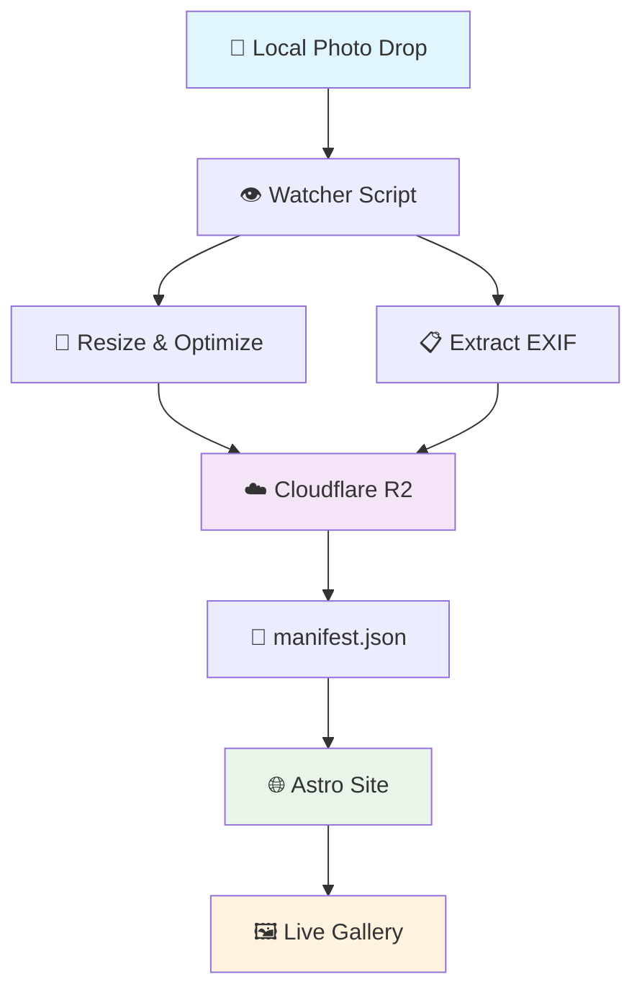

# 📸 Photo Gallery Automation


> A minimal, automated pipeline that transforms your local photo folder into a live, auto-updating web gallery.

## ✨ Features

- 🚀 **Instant Publishing**: Drop a photo → it appears live on your site
- 💸 **Cost Effective**: Powered by Cloudflare R2 with free egress and cheap storage
- 🔒 **Privacy First**: Automatically strips GPS data while preserving useful metadata
- ⚡ **High Performance**: Smart thumbnail generation and CDN caching
- 🛠️ **Zero Maintenance**: No manual deploys or rebuilds required

## 🏗️ Architecture Overview



## 🔧 Components

| Component | Purpose | Technology |
|-----------|---------|------------|
| 📁 **Local Folder** | Photo drop zone for new camera photos | File system watcher |
| 👁️ **Watcher Script** | Detects, resizes, and processes new photos | Node.js |
| ☁️ **Cloudflare R2** | Stores optimized photos and metadata | Object storage + CDN |
| 🌐 **Astro Frontend** | Static site displaying the live gallery | Astro.js |

## 🔄 Workflow

```bash
1. 📷 Drop photo in local folder
2. 🔍 Watcher detects new file
3. 🎨 Auto-resize (480px thumb + 1600px full)
4. 📊 Extract EXIF metadata (GPS stripped)
5. ⬆️ Upload to Cloudflare R2
6. 📝 Update manifest.json
7. 🌍 Photo appears live on website
```

## 🚀 Quick Start

### Prerequisites

- Node.js 18+
- Cloudflare account
- Astro CLI

### Installation

```bash
# Clone the repository
git clone https://github.com/yourusername/photo-gallery-automation.git
cd photo-gallery-automation

# Install dependencies
npm install

# Set up environment variables
cp .env.example .env
# Edit .env with your Cloudflare R2 credentials

# Start the watcher
npm run watch

# Deploy the Astro site
npm run deploy
```

## 🔒 Privacy & Performance

### Privacy Features
- ✅ **GPS Stripped**: Location data automatically removed
- ✅ **Metadata Preserved**: Camera, lens, and date information kept
- ✅ **Local Originals**: Source files never leave your machine

### Performance Optimizations
- 📦 **Smart Thumbnails**: 480px previews for fast loading
- 🖼️ **Optimized Full Size**: 1600px maximum for detail viewing
- 🌐 **CDN Delivery**: Global edge caching via Cloudflare
- 🔄 **No Rebuilds**: Dynamic manifest updates without site redeployment

## 📊 Cost Breakdown

| Resource | Usage | Monthly Cost |
|----------|-------|--------------|
| Storage (250MB) | Photos + metadata | ~$0.01 |
| Egress | Unlimited | $0.00 |
| API Requests | Low volume | Free tier |
| **Total** | | **< $0.05/month** |


## 📚 Documentation

- 📖 [**Architecture Guide**](docs/architecture.md) - Detailed technical documentation
- 🚀 [**Deployment Guide**](docs/deployment.md) - Step-by-step setup instructions
- 🔧 [**Configuration Reference**](docs/configuration.md) - All available options
- 🐛 [**Troubleshooting**](docs/troubleshooting.md) - Common issues and solutions

## 🤝 Contributing

Contributions are welcome! Please read our [Contributing Guide](CONTRIBUTING.md) for details.

## 📄 License

This project is licensed under the MIT License - see the [LICENSE](LICENSE) file for details.

## 🙏 Acknowledgments

- [Astro](https://astro.build/) - Static site framework
- [Cloudflare R2](https://developers.cloudflare.com/r2/) - Object storage
- [Sharp](https://sharp.pixelplumbing.com/) - Image processing

---

<div align="center">
  <p>Made with ❤️ for photographers who love automation</p>
  <p>
    <a href="#-photo-gallery-automation">⬆️ Back to top</a>
  </p>
</div>